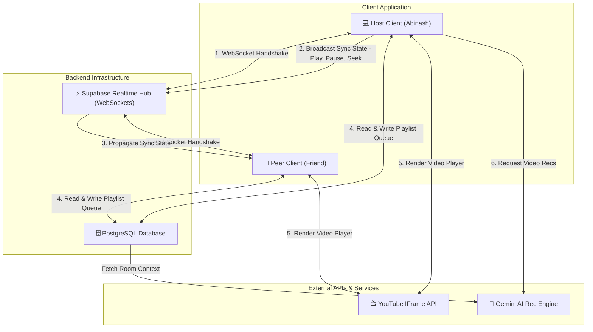

# 👋 Hi, I'm Abinash!

A passionate Full-Stack Developer dedicated to building high-performance, real-time web applications with rich user experiences. I specialize in modern JavaScript/TypeScript ecosystems, real-time sync engines, and sleek interface design.

---

## 🚀 Featured Project: 🎉 PlayParty
> **A Real-Time Collaborative Video Watching Application**
> 
> *Watch YouTube videos with friends in perfectly synchronized rooms, chat in real-time, and manage shared video queues.*

<div align="center">
  
  
  <br />

  [🎮 Live Demo](https://playparty.vercel.app) • [📄 Project Showcase & Docs](https://github.com/Abinash-Gope/PlayParty)
</div>

### 🛠️ Tech Stack & Architecture
* **Frontend**: `React 18` + `Vite` for sub-second hot module reloading.
* **Language**: `TypeScript` ensuring strict type-safety across client-side logic.
* **Styling**: `Tailwind CSS` & `shadcn/ui` for a premium, accessible component architecture.
* **State Management**: `React Query` & `React Context API`.
* **Backend & Real-Time Sync**: `Supabase Realtime` (WebSockets) for synchronizing room state, active presence, and chat logs.
* **Media Integration**: `YouTube IFrame API` wrapped in custom synchronization hooks.

### 🌐 System Architecture
The following flowchart illustrates how the synchronization engine connects multiple clients, Supabase WebSockets, database stores, and external APIs to achieve low-latency synchronization:



### 📂 Codebase Directory Tree
The codebase is structured to enforce strong separation of concerns, housing custom sync hooks, reusable ui elements, and real-time state managers:

```text
watch-party-hub/
├── supabase/                    # Supabase Database Migrations, Functions & Schema setups
├── public/                      # Static assets, backgrounds & branding resources
└── src/
    ├── components/              # Interactive UI Components
    │   ├── ui/                  # Primitive shadcn/ui components (Buttons, Dialogs, Inputs)
    │   ├── AIChatbot.tsx        # Real-time room AI assistant chatbot
    │   ├── ReactionBar.tsx      # Emoji bar for live room interaction
    │   ├── FloatingReactions.tsx# Floating screen micro-animations
    │   └── VideoQueuePanel.tsx  # Dynamic collaborative queue manager
    ├── hooks/                   # Custom Hooks for player hooks & backend APIs
    │   ├── useYouTubePlayer.ts  # Handlers for YouTube Player API integration
    │   ├── usePresence.ts       # Peer presence tracking engine
    │   ├── useRoom.ts           # Room state syncing & WebSocket orchestration
    │   └── useVideoReactions.ts # Reaction syncing logic
    ├── pages/                   # Views & Routing Handlers
    │   ├── WatchRoom.tsx        # Main theater room viewport
    │   ├── ExploreRooms.tsx     # Active public rooms lobby
    │   └── AIRecommendations.tsx# AI recommendations screen
    ├── lib/                     # Client configuration setups (e.g. supabaseClient)
    ├── App.tsx                  # Main router setup & layout configurations
    └── main.tsx                 # Bootstrap React mount endpoint
```

### ✨ Key Technical Features & Challenges Solved
1. **Real-time Playback Sync**: Developed a custom reconciliation loop inside `src/hooks/useYouTubePlayer.ts` that checks and matches client drift. When a user seeks or pauses, the state broadcasts through WebSockets, synchronizing other clients in under 100ms.
2. **Dynamic Peer Presence**: Utilized Supabase Presence tracking to manage active users, updating the roster live and triggering animated entry alerts on member join.
3. **Collaborative Queue Reconciliation**: Designed an optimistic UI update flow where users can search and queue videos instantly without wait lag. Client changes auto-resolve with PostgreSQL queue states in the background.

---

## 🛠️ Skills & Technologies

| Category | Technologies |
| :--- | :--- |
| **Frontend** | React, TypeScript, Next.js, Vite, HTML5, CSS3, Tailwind CSS, shadcn/ui |
| **Backend & Databases** | Node.js, Express, Supabase, PostgreSQL, REST APIs, WebSockets |
| **Tools & Devops** | Git & GitHub, npm/bun, Vercel, Netlify, Docker |

---

## 📈 GitHub Stats

<div align="center">
  
  
</div>
